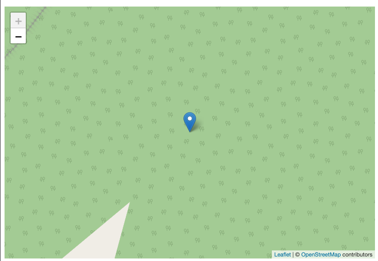

### Añadir marcador

Para añadir un simple marcador en el mapa, debemos de saber la ubicación del lugar mediante coordenadas geográficas (latitud y longitud) del punto que queremos indicar en nuestro mapa. Si desconocéis este dato, podéis recurrir a diferentes recursos para poder obtener coordenadas geográficas de manera muy fácil. Econtramos ejemplos como:
* [Google Maps](https://www.google.es/maps)
* [Openstreetmap](https://www.openstreetmap.org/)
* [We Go Here](https://wego.here.com/) **(MUY RECOMENDABLE)**

Lo debemos de implementar teniendo en cuenta lo siguiente:

```typescript
  // Información de la ubicación
  markers: Array<IMarker> = [
    {
      position: {
        lat: 21.3320135,
        lng: -157.8287631,
      },
    },
  ];
  // Para ajustar la cámara al marcador añadido
  config?: IConfigMap = {
    fitBounds: true,
  };
```

Añadiendo tanto en el componente como en el template:

```typescript
import { Component } from '@angular/core';
import { IConfigMap } from '@mugan86/ng-leaflet';

@Component({
  selector: 'my-app',
  templateUrl: './app.component.html',
  styleUrls: ['./app.component.css'],
})
export class AppComponent {
  // Información de la ubicación
  markers: Array<IMarker> = [
      {
        position: {
          lat: 21.3320135,
          lng: -157.8287631,
        },
      },
  ];
  // Para ajustar la cámara al marcador añadido
  config?: IConfigMap = {
      fitBounds: true,
  };
}

```

Aplicando en el HTML

```html
<ng-leaflet-map
  [mapId]="'basic_marker_map'"
  [markers]="markers"
  [config]="config"
>
</ng-leaflet-map>
```

Obteniendo el siguiente resultado:



Y aquí la demos para que podáis probarlo en vivo con las diferentes opciones:

[Stackblitz - Marcador ajustando la cámara](https://stackblitz.com/edit/angular-leaflet-map-with-marker?embed=1&file=src/app/app.component.html&theme=dark)
