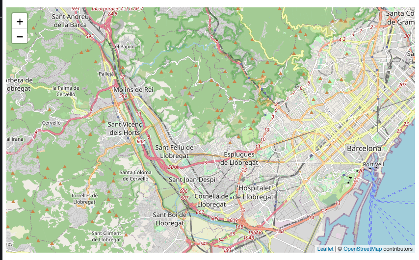

# Kokapenean erdiratu

En este momento queremos centrar la cámara del mapa en unas coordenadas que nosotros queramos especificar.

Hasta el momento, si no añadimos esta información utilizará una coordenadas por defecto teniendo como referencia un array con dos números en los que estarán la latitud y la longitud.

Las coordenadas lo tenemos que introducir en la siguiente estructura de la propiedad:

```typescript
configMap: IConfigMap = {
    center: [number, number],
    // [lat, lng] as  [number, number]
};
```

Konpoonentean informazio hau gehituko dugu:

```typescript
import { Component } from '@angular/core';
import { IConfigMap } from '@mugan86/ng-leaflet';
import { PLACES_LIST_LOCATIONS } from './locations';

@Component({
  selector: 'my-app',
  templateUrl: './app.component.html',
  styleUrls: ['./app.component.css'],
})
export class AppComponent {
  locations = PLACES_LIST_LOCATIONS;
  locationsKeys = Object.keys(this.locations);

  configMap: IConfigMap = {
    center: this.locations.BARCELONA as [number, number],
    // [lat, lng] as  [number, number]
  };
}
```

Informazioa HTML-ean gehituz:

```html
<ng-leaflet-map
  [mapId]="'center__position'"
  [config]="configMap"
></ng-leaflet-map>
```

Hurrengo emaitza lorturik:



Hona hemen adibidea proiektu gisa probatu eta aldaketak egiteko nahi dugun modura:

[Stackblitz - Kokapenean erdiratu](https://stackblitz.com/edit/angular-leaflet-map-basic-set-center-position?embed=1&file=src/app/app.component.ts&theme=dark)

