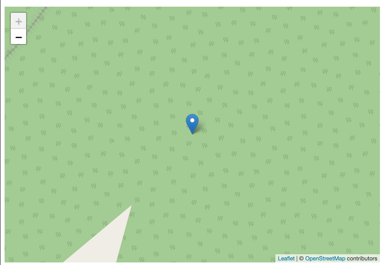

### Markagailua gehitu

Mapan oinarrizko markagailu bat gehitu ahal izateko, lekuaren koordenatu geografikoen (latitudea eta longitudea) puntua jakin beharko dugu gure mapan adierazteko. Datu hau ezezaguna baduzue, hurrengo esteken bidez koordenatu geografikoak lortu ahal ditugu era erraz batean. Honako adibide hauek aurkitzen ditugu:
* [Google Maps](https://www.google.es/maps)
* [Openstreetmap](https://www.openstreetmap.org/)
* [We Go Here](https://wego.here.com/) **(OSO GOMENDAGARRIA)**

Hurrengo kodea kontutan hartuta gehitu behar dugu:

```typescript
  // Kokapenaren informazioa
  markers: Array<IMarker> = [
    {
      position: {
        lat: 21.3320135,
        lng: -157.8287631,
      },
    },
  ];
  // Kamera finkatzeko markagailuaren arabera
  config?: IConfigMap = {
    fitBounds: true,
  };
```

Konponentea eta template gehiturik:

```typescript
import { Component } from '@angular/core';
import { IConfigMap } from '@mugan86/ng-leaflet';

@Component({
  selector: 'my-app',
  templateUrl: './app.component.html',
  styleUrls: ['./app.component.css'],
})
export class AppComponent {
  // Kokapenaren informazioa
  markers: Array<IMarker> = [
      {
        position: {
          lat: 21.3320135,
          lng: -157.8287631,
        },
      },
  ];
  // Kameraren ikuspegia egokitzeko markagailuaren kokapena kontutan izanda
  config?: IConfigMap = {
      fitBounds: true,
  };
}

```

HTML-ean aplikatuz

```html
<ng-leaflet-map
  [mapId]="'basic_marker_map'"
  [markers]="markers"
  [config]="config"
>
</ng-leaflet-map>
```

Hurrengo emaitza lortuko da:



Hurrengo estekan, adibidea daukazue eskura probatu eta aldaketak egiteko praktikatzeko asmoz:

[Stackblitz - Markagailua kamera finkatzen kokapenaren arabera](https://stackblitz.com/edit/angular-leaflet-map-with-marker?embed=1&file=src/app/app.component.html&theme=dark)
