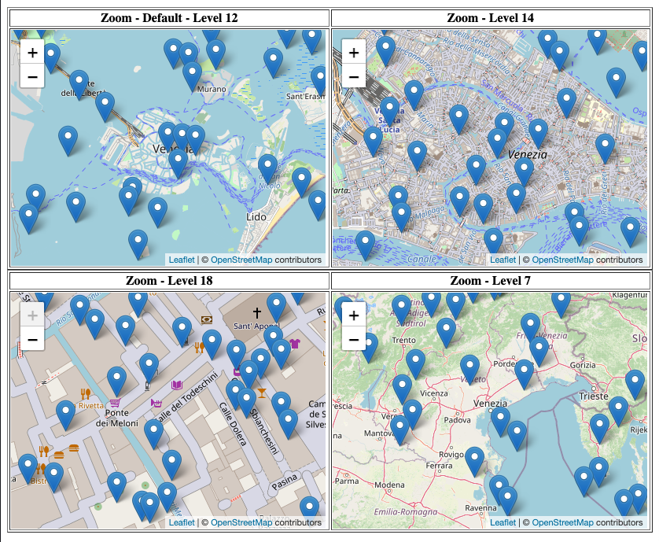

### Añadir marcadores aleatorios seleccionando el nivel del zoom

Esta opción es válida para cuando queramos añadir un mapa con una cantidad de marcadores aleatorios en un punto concreto.

Esto servirá para mostrar una demo sin tener que añadir los marcadores a mano de una manera sencilla y sin implementar muchas configuraciones.

A diferencia del anterior punto, seleccionaremos el nivel del zoom a un valor entre 0 (vista mundial) y 20 (lo más cercano), que será el establecido por defecto.

Lo debemos de implementar teniendo en cuenta lo siguiente:

```typescript
    randomMarkers = true;
    configMapLevelFourteen: IConfigMap = {
        center: [45.4374999, 12.3319962],
        zoom: {
            default: 14,
        },
    };
```

Añadiendo tanto en el componente como en el template:

```typescript
,
import { Component, VERSION } from '@angular/core';

@Component({
  selector: 'my-app',
  templateUrl: './app.component.html',
  styleUrls: ['./app.component.css'],
})
export class AppComponent {
    selectLocation = [45.4374999, 12.3319962]
    randomMarkers = true;
    // Zoom level default - 12
    configMap: IConfigMap = {
        center: this.selectLocation,
    };

    // Zoom level - 14
    configMapLevelFourteen: IConfigMap = {
        center: this.selectLocation,
        zoom: {
            default: 14,
        },
    };

    // Zoom level - 18
    configMapLevelEightteen: IConfigMap = {
        center: this.selectLocation,
        zoom: {
            default: 18,
        },
    };

    // Zoom level - 7
    configMapLevelSeven: IConfigMap = {
        center: this.selectLocation,
        zoom: {
            default: 7,
        },
    };
}

```

Aplicando en el HTML

```html
    <!-- Zoom level = 12 (default)-->
    <ng-leaflet-map
        [mapId]="'zoom_default'"
        [size]="{ height: '300px', width: '400px' }"
        [config]="configMap"
        [randomMarkers]="randomMarkers"
    ></ng-leaflet-map>

    <!-- Zoom level = 14-->
    <ng-leaflet-map
        [mapId]="'zoom_level_fourteen'"
        [size]="{ height: '300px', width: '400px' }"
        [config]="configMapLevelFourteen"
        [randomMarkers]="randomMarkers"
    ></ng-leaflet-map>

    <!-- Zoom level = 18-->
    <ng-leaflet-map
        [mapId]="'zoom_level_eighteen'"
        [size]="{ height: '300px', width: '400px' }"
        [config]="configMapLevelEightteen"
        [randomMarkers]="randomMarkers"
    ></ng-leaflet-map>

    <!-- Zoom level = 7-->
    <ng-leaflet-map
        [mapId]="'zoom_level_seven'"
        [size]="{ height: '300px', width: '400px' }"
        [config]="configMapLevelSeven"
        [randomMarkers]="randomMarkers"
    ></ng-leaflet-map>

```

Obteniendo el siguiente resultado:



Y aquí la demo para que podáis probarlo en vivo con las diferentes opciones:

[Stackblitz - Marcadores aleatorios seleccionando nivel de zoom](https://stackblitz.com/edit/angular-leaflet-zoom-levels-random-markers?embed=1&file=src/app/app.component.ts&theme=dark)

