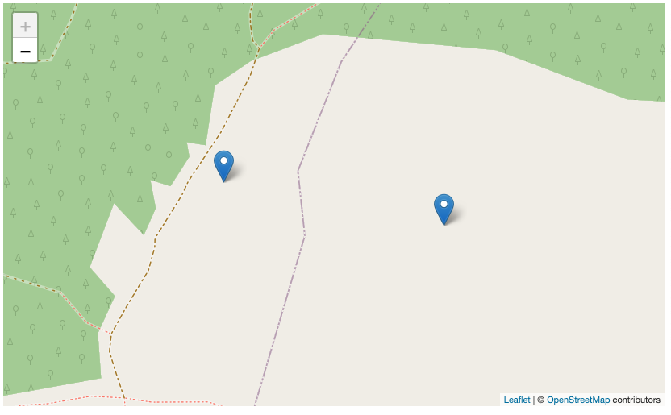

### Markagailu bat baino gehiago gehitu

Mapan markagailu bat baino gehitu ahal izateko, honetan finkatu nahi ditugun kokapenen koordenatu geografikoak (latitudea eta longitudea) jakin behar ditugu itsatsi ahal izateko. Gogoratu, aurreko atalean dituzuela erabilgarri zenbait aukera kokapenak bere informazioekin erabili ahal izateko atal honetan.

Hurrengo kodea kontutan hartuta gehitu behar dugu:

```typescript
    // Kokapenaren informazioa
  markers: Array<IMarker> = [
        {
          position: {
            lat: 43.17757110078426,
            lng: -2.3661233885984085,
          },
        },
        {
          position: {
            lat: 43.177781697765305,
            lng: -2.367583962060063,
          },
        },
  ];
  // Kamera egokitzeko, sartutako markagailu zerrendarekin
  config?: IConfigMap = {
    fitBounds: true,
  };
```

Konponentea eta template gehiturik:

```typescript
import { Component } from '@angular/core';
import { IConfigMap } from '@mugan86/ng-leaflet';

@Component({
  selector: 'my-app',
  templateUrl: './app.component.html',
  styleUrls: ['./app.component.css'],
})
export class AppComponent {
    // Kokapenaren informazioa
    markers: Array<IMarker> = [
        {
            position: {
                lat: 43.17757110078426,
                lng: -2.3661233885984085,
            },
        },
        {
            position: {
                lat: 43.177781697765305,
                lng: -2.367583962060063,
            },
        },
    ];
    // Para ajustar la cámara al marcador añadido
    config?: IConfigMap = {
        fitBounds: true,
    };
}

```

Aplicando en el HTML

```html
<ng-leaflet-map
  [mapId]="'two_markers_map'"
  [markers]="markers"
  [config]="config"
>
</ng-leaflet-map>
```

Obteniendo el siguiente resultado:



Y aquí la demo para que podáis probarlo en vivo con las diferentes opciones:

[Stackblitz - Marcadores ajustando la cámara](https://stackblitz.com/edit/angular-leaflet-map-with-markers?embed=1&file=src/app/app.component.ts&theme=dark)