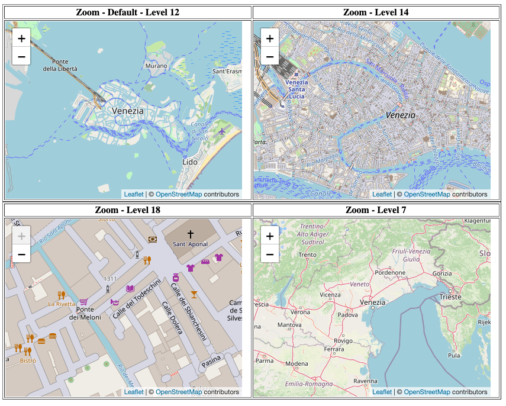

# Maila

Después de trabajar con los controles de posición y los textos de los botones **'+'** nahiz **'-'** botoiekin eta zoom-aren kotrol posizioarekin lan egin ostean, zoom-aren maila konfiguratzen ikasiko dugu.

Zoom mailaren konfigurazio ez badugu gehitzen, **zehaztuko den zoom-aren balioa era lehenetsian 12 izango da**.

Kontutan eduki behar dugu zoom-aren maila 0 eta 20 bitarttekoa dela, biak barne

Zoom kontrola zuzen gehitu ahal izateko, zoom maila desberdinetan, egin behar duguna da (**IConfigMap**) hartu eta honen barruan **"zoom"** propietatearen barruan **"default"** balorean zenbaki oso bat gehitu beharko dugu, 0 eta 20 artean. Esan den bezala, kopururik sartzen ez badugu, hartuko duen era lehenetsiko zenbakia 12 izango da.

Zehaztu beharra dugu hurrengoa kontutan hartuta:

```typescript
configMap: IConfigMap = {
    zoom: {
      default: 16 // Número entre 0 y 20 incluidos
    },
};
```

Konponentea bai plantilla gehiturik:

```typescript
import { Component } from '@angular/core';
import { IConfigMap } from '@mugan86/ng-leaflet';

@Component({
  selector: 'my-app',
  templateUrl: './app.component.html',
  styleUrls: ['./app.component.css'],
})
export class AppComponent {
  configMap: IConfigMap = {
    zoom: {
      position: 16, // Número entre 0 y 20 incluidos
    },
  };
}
```

HTML-an zehaztuz

```html
<ng-leaflet-map [mapId]="'zoom_controls'" [config]="configMap"></ng-leaflet>
```

Hurrengo emaitza lorturik:



Hurrengo estekan, adibidea daukazue eskura probatu eta aldaketak egiteko praktikatzeko asmoz:

[Stackblitz - Zoom mailak](https://stackblitz.com/edit/angular-leaflet-zoom-levels?embed=1&file=src/app/app.component.ts&theme=dark)
