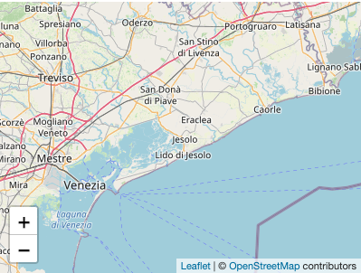

# Posición / Textos botones

Ahora que ya [sabemos trabajar con lo básico de los mapas](../aspectos-basicos/mapa-basico.md), vamos a comenzar a trabajar con los controles donde nos centramos en el control del zoom.

En este apartado se va a aprender a ubicar el control del zoom en las diferentes opciones y también como habilitar los textos que se asignan a los botones "+" y "-" para aumentar / disminuir el zoom.

### Ubicar en posición

Para añadir el control del zoom, en diferentes posiciones, dentro del apartado de configuración (**IConfigMap**) tenemos que añadir dentro de **"zoom"** en la propiedad **"position"** los siguientes valores para ubicar el control en el mapa:

* **bottomleft**: Behean ezkerretara.
* **bottomright**: Behean eskuinean.
* **topright**: Goian eskuinean.
* **topleft**: Goian ezkerretara, era lehenetsian aukera hau da.

Lo debemos de implementar teniendo en cuenta lo siguiente:

```
configMap: IConfigMap = {
    center: [number, number],
    // [lat, lng] as  [number, number]
    zoom: {
      position: 'bottomleft', // 'topright', 'topleft', 'bottomleft', 'bottomright'
    },
};
```

Konponentea eta plantilla aplikatuz:

```
import { Component } from '@angular/core';
import { IConfigMap } from '@mugan86/ng-leaflet';

@Component({
  selector: 'my-app',
  templateUrl: './app.component.html',
  styleUrls: ['./app.component.css'],
})
export class AppComponent {
  configMap: IConfigMap = {
    center: [45.4374999, 12.3319962],
    zoom: {
      position: 'bottomleft', // 'topright', 'topleft', 'bottomleft', 'bottomright'
    },
  };
}

```

HTML-an aplikatzen

```
<ng-leaflet-map [mapId]="'zoom_controls'" [config]="configMap"></ng-leaflet>
```

Hurrengo emaitza lortuz:



Hemen adibidea daukazue ikusgai frogak egiteko kodearekin eta aukera desberdinekin:

[Stackblitz - Zoom kontrolaren kokapena](https://stackblitz.com/edit/angular-leaflet-zoom-positions-titles?embed=1&file=src/app/locations.ts&theme=dark)
